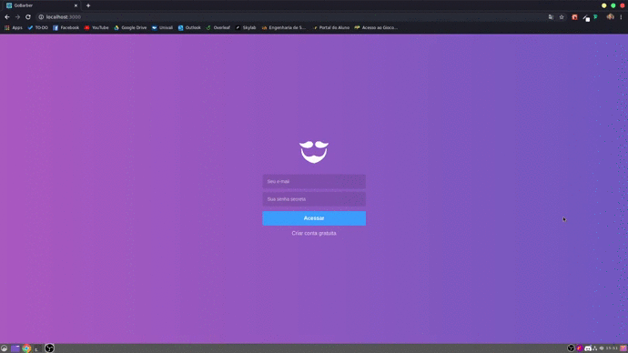

<h1 align="center">
    
</h1>

<h4 align="center">
   Projeto Bootcamp GoStack by Rocketseat
</h4>

  
  

## 📱 Front-end
A aplicação front-end do projeto GoBarber é a parte do sistema que vai ser utilizada pelos prestadores de serviços para que possam gerenciar seus horários. Conta com quatro interface: Login, Cadastro de Usuário, Dashboard e Profile.

    

## 🔄 Executar
- Entrar na pasta `frontend`;
 - Executar `yarn install` para instalar dependências do projeto;
 - Executar `yarn start` para que o projeto seja executado;

 ## 📝 Licença
Este projeto está sobre a licença MIT. Veja o arquivo [LICENSE](../LICENSE.md) para mais detalhes.

---
<h4 align="center">
  Feito com ❤️ by Gustavo Souza
</h4>
