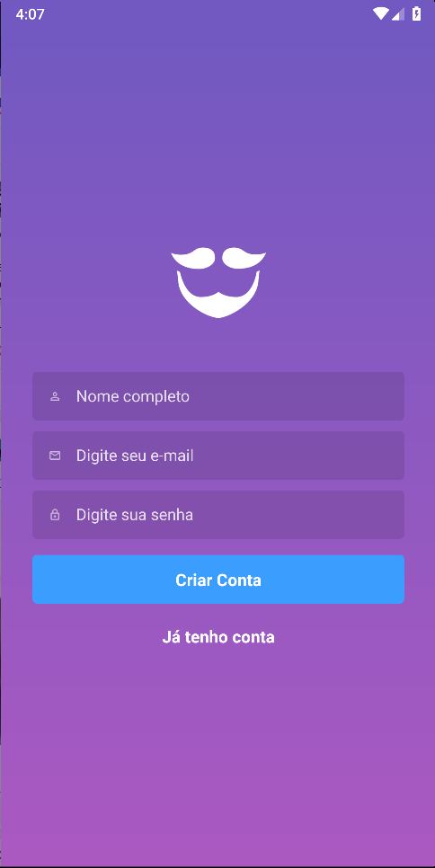
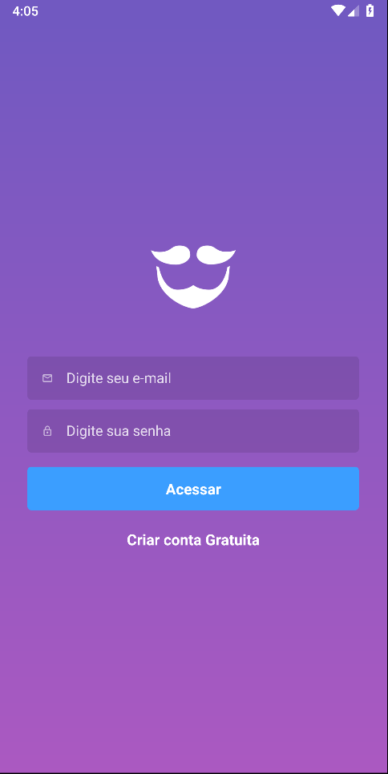
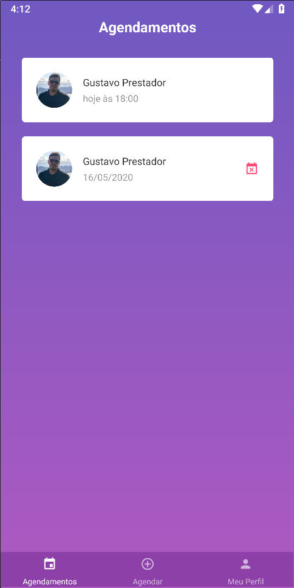
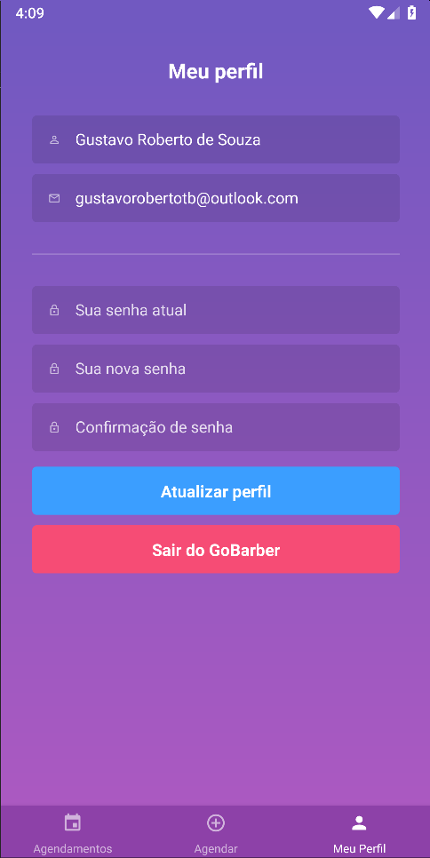
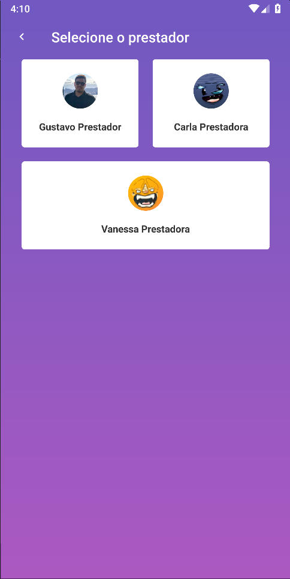
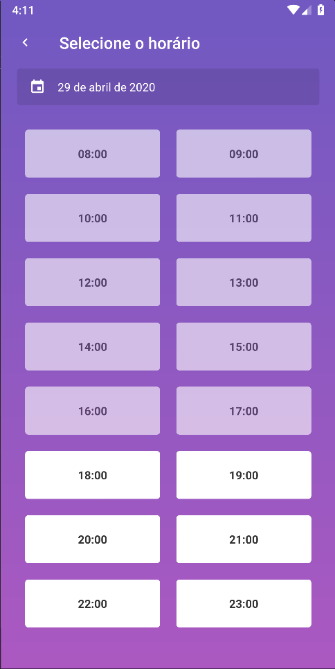
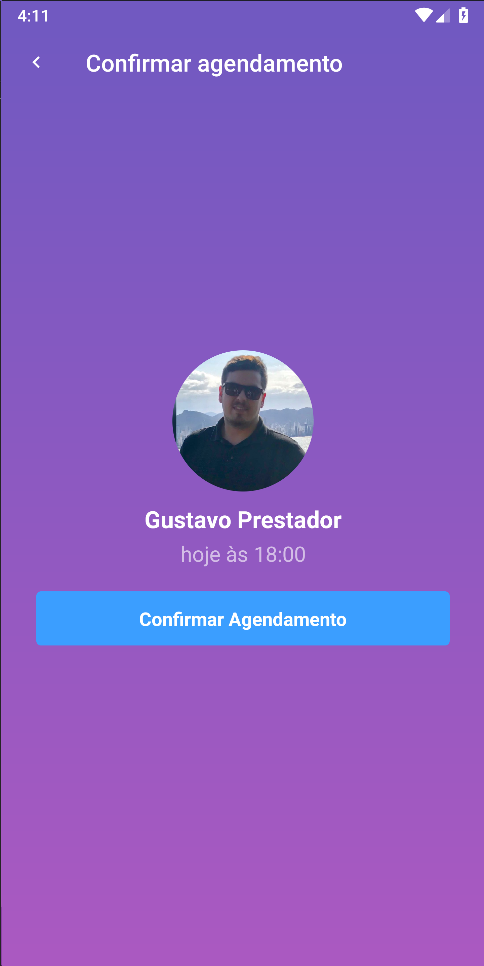

<h1 align="center">
    
</h1>

<h4 align="center">
  Projeto Bootcamp GoStack by Rocketseat
</h4>

  
  

## 📱 Mobile
O aplicativo mobile da aplicação GoBarber é destinada ao usuário que deseja principalmente realizar agendamento com algum prestador de serviço. É possível alterar seu perfil, realizar agendamento, cancelar agendamento e verificar agendamentos antigos.

    
    
    
    
    
    
    
    

## 🔄 Executar

 - Entrar na pasta `mobile`;
 - Executar `yarn install` para instalar dependências do projeto;
 - Executar `yarn react-native run-android` ou `yarn react-native run-ios` para que seja feito upload do app no emulador;
 - Executar `yarn react-native start` para que o projeto seja executado;

    *Essa versão do sistema foi testada no emulador Android;

 ## 📝 Licença
Este projeto está sobre a licença MIT. Veja o arquivo [LICENSE](../LICENSE.md) para mais detalhes.

---
<h4 align="center">
  Feito com ❤️ by Gustavo Souza
</h4>
